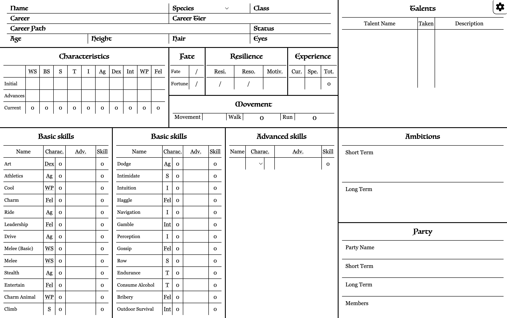
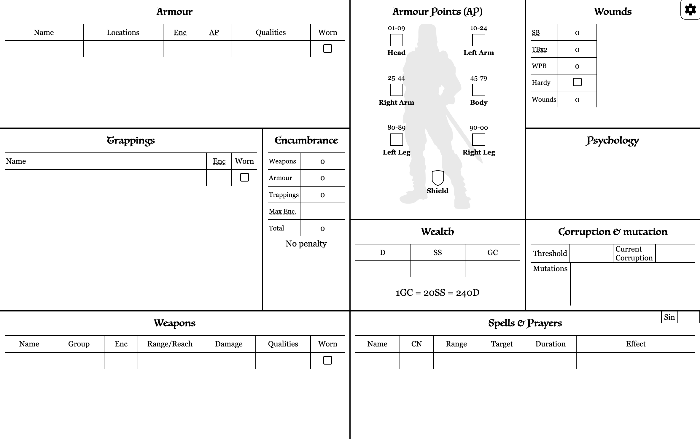
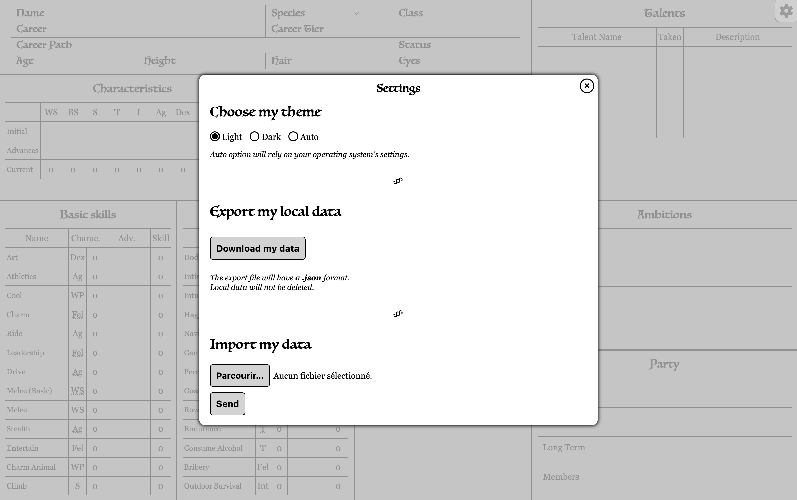

   

# Warhammer Fantasy RolePlay (4th edition) sheet
An online tool to help you manage your **Warhammer Fantasy Role Play** game's character sheet

## Screenshots

### Page 1

### Page 2

### Settings modal

[See for yourself](https://gooz.github.io/wfrp-sheet/)
## App's presentation

No Ads, no tracker and no data storage on a server, whether it's personal data or not.

All your data is stored on your localStorage, meaning it stays in your browser's storage, on your computer.

It comes with several features to make your life easier.

## App's features
  - Auto-filled fields
  - Auto-calculated final values (initial + advances)
  - Responsive layout
  - Dark mode
  - Highlight for characteristics, career skills and talents
  - Import/Export data
  - Internationalisation (i18n)

### Rules
#### Personal infos section
- Every field is an open field except for the *species* one which will impact the **wounds** section (see below).

#### Characteristics section
- Only *initial* fields and *advances* fields for each characteristic are editable (**numbers only**), the *current* field is auto-calculated based on the two fields set above.
- Note that the *current* value will be used at several places in the app.

#### Points section
- For **Fate** and **Resilience** tables, every field is open (**numbers only**) and not related to anything else.
- **Experience** table has its *current* & *spent* fields open (**numbers only**) but the *total* one is auto-calculated base on those two previous fields.

#### Movement section
- *Walk* and *run* are auto-calculated based on the value set in the *movement* field (**numbers only**).

#### Basic skills
- For every skill, the only open field is the *advances* one (**numbers only**). The characteristic base one is auto-filled with the *current characteristic*’s value and the *skill* one is auto-calculated based on the values of the base and the advance.

#### Custom skills
- Same logic here than the **basic skills** section except that you can select the *characteristic base* in the select dropdown which will auto-fill the *current characteristic* value right on the side.

#### Talents section
- Only open fields unrelated to anything else.

#### Ambitions section
- Only open fields unrelated to anything else.

#### Party section
- Only open fields unrelated to anything else.

#### Armour section
- All fields are open.
- *Encumbrance* is **numbers only**.
- *Worn* checkbox, if checked, will affect the **Encumbrance** section.

#### Trappings section
- All fields are open.
- *Encumbrance* is **numbers only**.
- *Worn* checkbox, if checked, will affect the **Encumbrance** section.

#### Weapons section
- All fields are open
- *Encumbrance* is **numbers only**.
- *Worn* checkbox, if checked, will affect the **Encumbrance** section.

#### Encumbrance section
- *Weapons*, *armour* & *trappings* fields will automatically reflect the total weight for their respective type, meaning it will add up the weight of all its registered items and put the total in its field.
- Every item in the **weapons**, **armour** & **trappings** sections with the *worn* property checked will see its weight reduced by 1 which will affect the total just as specified above.
- *Maximum encumbrance* field is open because some talents may change the way it works but it is **numbers only**.
- *Total* field is auto-calculated. If the total of *Weapons*, *armour* & *trappings* values is strictly greater than the *maximum encumbrance* value then you’ll be notified that you reached the state of **overburdened**.

#### Armour points section
- All fields are open and **numbers only**

#### Wounds section
- All fields are auto-calculated.
    - *Strength bonus* is based on your *current Strength characteristic* and only applied if your *species* is **not halfling**
    - *Tougness bonus* is based on your *current Toughness characteristic*
    - *Will power bonus* is based on your *current Will power characteristic*
    - *Hardy* checkbox is to be checked if you actually bought the talent. If so, it will update the total wounds accordingly.
    - *Total* adds up every fields above.
- The *current wounds* field is open and **numbers only**

#### Wealth section
- Only open fields (**numbers only**) unrelated to anything else.

#### Psychology section
- Only an open field unrelated to anything else.

#### Corruption section
- Only open fields unrelated to anything else.
- *Threshold* and *current corruption* are **numbers only** when *mutation* accepts anything.

#### Spells & prayers section
- Only open fields unrelated to anything else.

### Data
As specified before, this app relies on **[LocalStorage](https://developer.mozilla.org/en-US/docs/Web/API/Window/localStorage)**.

There’s no specificity on how or how long a browser should retain data stored in its localstorage so not every browser does the same.

If you’re using any **blink-based** (Chrome, Edge, Brave, Vivaldi, etc) or **Gecko-based** (Firefox) browsers, you should be fine as they only empty the data if they run out of space. As a fail safe though the app asks for a permission to  make the data persistent, meaning it allows the browsers to keep your data even if they run out of space. 

Surprisingly enough only Firefox is actually asking the user for the permission to do so. 

In any case, **you don’t have to accept**, it should ensures the longevity of your local data but you would still be able to store data locally if you deny the permission.

As for **Safari**, any local data on a website not visited **within 7 days** will be trashed. On iOS, it should not be the case if you add the website on your homescreen though, as if it was an app.

In any case, I strongly suggest everyone using this app to do some backup export  of your data every once in a while, and maybe every time you end your session if you’re using Safari.

To do so, you can open the **Settings** modal by clicking on the gear icon button in the top right corner of the app.
In the modal you will be able to download your data by clickin the button. 
Just below that button, you’ll see the mean to upload your saved data.

Any lost data will be lost forever, it’s your responsability.

### Highlight
By hovering a row or focusing in a field in a row on a skill or talent table, or by hovering a characteristics, you’ll see an important (!) icon button appear. By clicking this button you’ll highlight this skill/talent/characteristic so you can know right away what depends on your career and should be increased to evolve in your career path.
Clicking this button on an already highlighted skill will remove the highlight.

### i18n
Personally I don't plan to add other languages than english and french mostly because these are the only two I can read and write well enough.

That being said, if needed and if provided by a Pull Request, I could add new languages without a problem, the translation system is here and waiting for new ones. Like the Russian language recently added by [starp0m](https://github.com/starp0m).

## For Developers
If you want to modify this app for your own copy or to make a pull request later you'll mostly need Node.js and a code editor.

1. Clone, fork or download the repo or whatever
2. Run `npm ci` to download & install dependencies. This app runs on [11ty](https://www.11ty.dev/) and some plugins but that's pretty much it.
3. Do your thing.
4. Run `npm run start` to start the local server and see your changes in your browser
5. Profit 🎲

**Pull requests and Issues are obviously welcome.**

[That's cool, now show me what it looks like](https://gooz.github.io/wfrp-sheet/)
